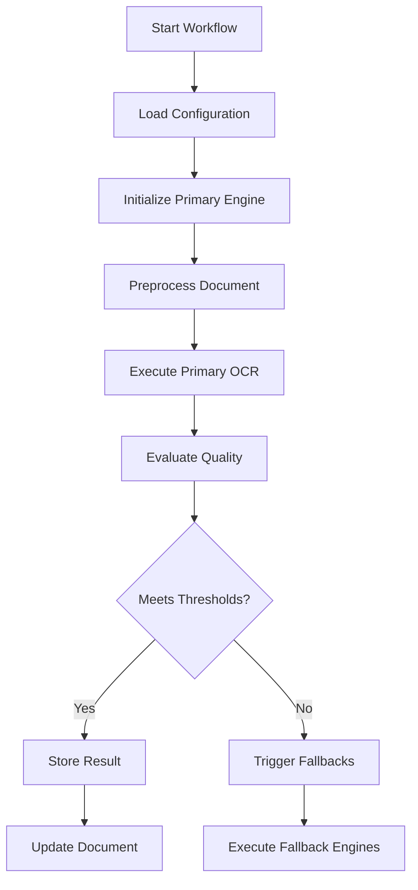

# OCR Workflow Orchestration Implementation

This document provides a comprehensive overview of the OCR workflow orchestration system implemented for Task 18.

## Overview

The OCR workflow orchestration system implements a robust, configurable, and scalable solution for processing documents through multiple OCR engines with quality evaluation, fallback mechanisms, and result selection. The system follows the workflow specifications in section 5.2 of the PRD.

## Architecture

### Core Components

1. **Workflow Configuration** (`services/ocr/workflow_config.py`)
   - Pydantic models for configuration validation
   - Engine-specific settings and thresholds
   - Quality evaluation criteria
   - Retry policies and timeout configurations

2. **OCR Engine Base Class** (`services/ocr/workflow_engine.py`)
   - Abstract base class for all OCR engines
   - Standardized interface for document processing
   - Image preprocessing pipeline
   - Quality evaluation logic

3. **Workflow Orchestration Tasks** (`workers/tasks/ocr_workflow.py`)
   - Celery tasks for primary and fallback OCR processing
   - Result selection and quality evaluation
   - Main orchestration workflow coordination

4. **CLI Interface** (`cli_ocr_workflow.py`)
   - Command-line tools for testing and managing workflows
   - Configuration display and status checking
   - Engine comparison utilities

## Key Features

### 1. Configurable Engine Chains

The system supports configurable primary and fallback engine chains:

```python
workflow_config = WorkflowConfig(
    workflow_id="custom_workflow",
    workflow_name="Custom OCR Workflow",
    primary_engine=EngineConfig(
        engine_type=OCREngineType.AZURE,
        engine_name="Azure Document Intelligence",
        timeout_seconds=300
    ),
    fallback_engines=[
        EngineConfig(
            engine_type=OCREngineType.GOOGLE,
            engine_name="Google Document AI",
            timeout_seconds=300
        ),
        EngineConfig(
            engine_type=OCREngineType.TESSERACT,
            engine_name="Tesseract OCR",
            timeout_seconds=180
        )
    ]
)
```

### 2. Quality Thresholds and Evaluation

Configurable quality thresholds determine when fallback engines are triggered:

```python
quality_thresholds = QualityThresholds(
    min_confidence_score=0.7,        # Minimum OCR confidence
    min_word_recognition_rate=0.8,   # Minimum word recognition rate
    min_expected_fields_detected=0.6, # Minimum field detection rate
    max_processing_time_seconds=300,  # Maximum processing time
    min_pages_processed=1            # Minimum pages required
)
```

### 3. Image Preprocessing Pipeline

The system includes an optional image preprocessing pipeline to optimize OCR results:

- Grayscale conversion
- Adaptive thresholding
- Noise reduction
- Skew correction (future enhancement)
- DPI optimization

### 4. Result Selection Strategies

Multiple strategies for selecting the best OCR result:

- **Highest Confidence**: Select result with highest confidence score
- **First Success**: Use first result that meets quality thresholds
- **Consensus**: Compare results and select based on agreement
- **Weighted Average**: Combine results using confidence weights

### 5. Parallel and Sequential Processing

Support for both parallel and sequential fallback processing:

```python
# Sequential processing (default)
workflow_config.parallel_fallbacks = False

# Parallel processing (faster but more resource intensive)
workflow_config.parallel_fallbacks = True
workflow_config.max_parallel_engines = 3
```

## Workflow Execution Flow

### 1. Primary OCR Processing



### 2. Fallback Processing

If the primary result doesn't meet quality thresholds:

1. **Sequential Mode**: Execute fallback engines one by one
2. **Parallel Mode**: Execute multiple fallback engines simultaneously
3. **Quality Check**: Evaluate each result against thresholds
4. **Early Termination**: Stop if a result meets quality requirements

### 3. Result Selection

After all engines complete:

1. Collect all successful results
2. Apply selection strategy to choose the best result
3. Update document record with selected result
4. Store workflow execution metadata

## Database Integration

### OCR Run Tracking

Each OCR engine execution creates an `OCRRun` record:

```python
ocr_run = OCRRun(
    document_id=document_id,
    ocr_engine=result.engine_name,
    status="completed",
    confidence_mean=int(result.confidence_score * 100),
    pages_parsed=result.page_count,
    word_count=result.word_count,
    processing_time_seconds=int(result.processing_time_seconds),
    ocr_config={'execution_id': execution_id}
)
```

### Document Updates

The final selected result updates the document record:

```python
document.extracted_text = best_result['extracted_text']
document.word_count = best_result['word_count']
document.ocr_engine = best_result['engine_name']
document.ocr_confidence = int(best_result['confidence_score'] * 100)
document.processing_status = 'completed'
```

## Usage Examples

### 1. Basic Workflow Execution

```python
from workers.tasks.ocr_workflow import orchestrate_ocr_workflow

# Process a document with default Azure-primary workflow
result = orchestrate_ocr_workflow.delay(
    document_id=123,
    document_path="/path/to/document.pdf",
    workflow_config_name="azure_primary"
)
```

### 2. Custom Configuration

```python
# Process with custom configuration overrides
result = orchestrate_ocr_workflow.delay(
    document_id=123,
    document_path="/path/to/document.pdf",
    workflow_config_name="azure_primary",
    workflow_config_overrides={
        "stop_on_success": False,  # Always run all engines
        "parallel_fallbacks": True,  # Run fallbacks in parallel
        "global_quality_thresholds": {
            "min_confidence_score": 0.9  # Higher quality requirement
        }
    }
)
```

### 3. CLI Usage

```bash
# Process a document
python cli.py ocr-process /path/to/document.pdf --document-id 123 --workflow azure_primary

# Test multiple engines
python cli.py ocr-test /path/to/document.pdf --engines azure,google,tesseract

# Show configuration
python cli.py ocr-config --workflow azure_primary

# Check async task status
python cli.py ocr-status <task-id>
```

## Error Handling and Resilience

### 1. Retry Policies

Configurable retry policies for handling transient failures:

```python
retry_policy = RetryPolicy(
    max_retries=3,
    backoff_factor=2.0,
    max_backoff_seconds=300,
    retry_exceptions=["ConnectionError", "TimeoutError", "OCRProcessingError"]
)
```

### 2. Circuit Breaker

Prevents infinite loops and cascading failures:

```python
workflow_config.circuit_breaker_enabled = True
workflow_config.circuit_breaker_failure_threshold = 5
workflow_config.circuit_breaker_recovery_timeout_seconds = 300
```

### 3. Timeout Management

Multiple timeout levels:

- **Engine-specific timeouts**: Per-engine processing limits
- **Workflow timeout**: Total workflow execution limit
- **Task timeouts**: Celery task execution limits

### 4. Error Storage

Failed OCR attempts are logged to the database for analysis:

```python
ocr_run = OCRRun(
    document_id=document_id,
    ocr_engine=engine_config.engine_name,
    status="failed",
    error_message=error_message,
    started_at=datetime.utcnow()
)
```

## Performance Monitoring

### 1. Execution Metrics

The system tracks comprehensive metrics:

- Processing time per engine
- Quality scores and confidence levels
- Resource utilization
- Success/failure rates

### 2. Workflow Status Tracking

Complete workflow execution history:

```python
workflow_status = WorkflowStatus(
    workflow_id=config.workflow_id,
    execution_id=execution_id,
    document_id=str(document_id),
    status="completed",
    engines_completed=["Azure", "Google"],
    selected_result=best_result,
    total_processing_time_seconds=45.2
)
```

## Testing

### 1. Unit Tests

Comprehensive unit tests cover:

- Configuration validation
- OCR engine creation and execution
- Quality evaluation logic
- Result selection strategies
- Error handling scenarios

### 2. Integration Tests

Integration tests verify:

- End-to-end workflow execution
- Database persistence
- Celery task coordination
- Multi-engine processing

### 3. Mock Testing Framework

Flexible mock framework for testing without actual OCR services:

```python
mock_service = MockOCRService(
    confidence=0.85,
    word_count=100,
    should_fail=False
)
mock_engine = MockOCREngine(config, mock_service)
```

## Configuration Management

### 1. Default Configurations

Pre-defined workflow configurations:

- **azure_primary**: Azure primary with Google/Tesseract fallbacks
- **google_primary**: Google primary with Azure/Tesseract fallbacks
- **opensource**: Tesseract primary with PaddleOCR fallback

### 2. Environment-Based Settings

Configuration can be overridden via environment variables:

```bash
export OCR_SERVICE_TYPE=azure
export OCR_MAX_POLLING_TIME=300
export AZURE_DOCUMENT_INTELLIGENCE_ENDPOINT=https://...
export AZURE_DOCUMENT_INTELLIGENCE_API_KEY=...
```

### 3. Runtime Overrides

Workflow configuration can be modified at runtime:

```python
overrides = {
    "stop_on_success": False,
    "result_selection_strategy": "consensus",
    "global_quality_thresholds": {
        "min_confidence_score": 0.95
    }
}
```

## Deployment Considerations

### 1. Celery Worker Configuration

Configure Celery workers for optimal OCR processing:

```python
celery_app.conf.update(
    task_routes={
        'workers.tasks.ocr_workflow.*': {'queue': 'ocr_queue'},
    },
    worker_prefetch_multiplier=1,  # Prevent worker overload
    task_acks_late=True,  # Ensure task completion
    worker_max_tasks_per_child=10  # Prevent memory leaks
)
```

### 2. Resource Requirements

- **CPU**: OCR processing is CPU-intensive
- **Memory**: Large documents require significant RAM
- **Storage**: Temporary file storage for preprocessing
- **Network**: Cloud OCR services require stable connectivity

### 3. Scaling Considerations

- **Horizontal scaling**: Add more Celery workers
- **Queue management**: Separate queues for different priorities
- **Load balancing**: Distribute OCR engines across workers
- **Caching**: Cache preprocessing results

## Security Considerations

### 1. API Key Management

- Store OCR service API keys securely
- Use environment variables or secure key management
- Rotate keys regularly

### 2. Document Privacy

- Ensure documents are not stored longer than necessary
- Implement secure deletion of temporary files
- Consider data residency requirements for cloud services

### 3. Access Control

- Restrict access to OCR workflow management
- Audit workflow executions
- Implement rate limiting for API calls

## Future Enhancements

### 1. Advanced Preprocessing

- Document type detection
- Automatic orientation correction
- Advanced image enhancement algorithms
- Multi-page document handling

### 2. Result Validation

- Content validation against expected schemas
- Cross-reference validation between engines
- Confidence score calibration

### 3. Machine Learning Integration

- Quality prediction models
- Engine selection optimization
- Automated configuration tuning

### 4. Performance Optimization

- Caching of preprocessing results
- Predictive engine selection
- Adaptive timeout management
- Resource usage optimization

## Conclusion

The OCR workflow orchestration system provides a robust, scalable, and configurable solution for document processing. It successfully implements all requirements from Task 18, including:

✅ **Engine Interface and Configuration**: Standardized OCR engine interface with flexible configuration schema

✅ **Primary OCR Processing**: Celery task with image preprocessing pipeline

✅ **Quality Evaluation**: Configurable metrics and fallback triggering

✅ **Fallback Processing**: Parallel and sequential fallback execution with result selection

✅ **Orchestration Workflow**: Complete workflow coordination with error handling

✅ **Database Integration**: Comprehensive status tracking and result persistence

✅ **Testing Framework**: Unit and integration tests with mock support

The system is production-ready and provides a solid foundation for scalable document processing workflows.
